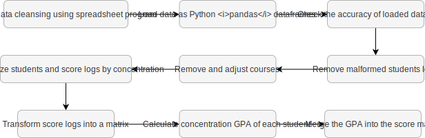

# UPH Informatics Concentration Recommender System

## Background

Most universities have what is named as an academic concentration, which is a branch of an academic major. This includes the Informatics Major in Universitas Pelita Harapan. Choosing the right academic concentration is very important, as it determines the main focus for students to learn on for more than half of their university lifetime.

Unfortunately, there is little information available to help students decide their concentration. Considering the fact that students also strive for academic success, this application tries to give an insight to help them choose the right concentration. Given a list of course scores for the first four semesters, the student will be given the predicted rate of success for each Informatics major concentration.

## Getting Started

To run this app, make sure you have the mentioned prerequisites and follow the installation steps below.

### Prerequisites

* [Python3](https://www.python.org/downloads/)
* [pip](https://pypi.org/project/pip/)

### Installing

Before installing any libraries, it is better to have a clean slate Python environment. To do so, we can make a Python virtual environment by running:

```sh
python3 -m venv myvenv
```

The command above will create a directory called `myvenv` in the project root. To activate the virtual environment, run the following command:

```sh
# For Windows users
$ .\myvenv\Scripts\activate.bat

# For UNIX or MacOS
$ source myvenv/bin/activate
```

Your terminal prompt will be prepended by the name of the virtual environment. For instance, activating `myvenv` would cause the terminal to look like this:

```sh
$ source myvenv/bin/activate
(myvenv) $ _
```

> **Make sure the virtual environment is already activated**

There are several libraries used for this project, all of them are listed in `requirements.txt`. To install all of them, simply run the following command from the project directory.

```sh
(myvenv) $ pip install -r requirements.txt
```

***IF***, however, you want to install the libraries manually, here are the links to the crucial ones:

* [dash](https://dash.plot.ly/)
* [dash-bootstrap-components](https://github.com/facultyai/dash-bootstrap-components)
* [pandas](https://pandas.pydata.org/)
* [numpy](https://www.numpy.org/)
* [scikit-learn](https://scikit-learn.org/)
* [Jupyter](https://jupyter.org/)

### Running the app

> **Make sure the virtual environment is still activated**

The app was built using [Dash](https://dash.plot.ly/). To run the app locally, run the following command from the project root directory:

```sh
(myvenv) $ python main.py
Running on http://127.0.0.1:8050/
Debugger PIN: XXX-XXX-XXX
 * Serving Flask app "main" (lazy loading)
 * Environment: production
   WARNING: This is a development server. Do not use it in a production deployment.
   Use a production WSGI server instead.
 * Debug mode: on
Running on http://127.0.0.1:8050/
Debugger PIN: XXX-XXX-XXX
...
```

You can open the app on the browser by accessing `http://127.0.0.1:8050/`.

## Usage

// TODO: add screenshots and explanation

## Implementation steps



The diagram above shows several major steps in the whole development process, each of which is going to be explained in the following subsections.

### Data acquisition

With permission from UPH, the data were gathered from their database for all students, including alumnis from previous years. The gathered Informatics students' data were from cohorts 2012 until 2015. Along with them, past curriculum structures were also given.

### Data cleansing

The raw data *needed* to be transformed so that the prediction model can be trained. The process can be roughly summarized in the diagram below. If you want to understand its further details, you can read them [***here***](notebooks/preprocess.ipynb).



### Model training + test

The prediction model is trained using a variant of Support Vector Machine (SVM) called Support Vector Regression (SVR). Its parameters are tuned using GridSearch. Full explanation can be seen [***here***](docs/model.md)

### Frontend development using Dash

The entry point of the web application is on `main.py`. Other components live inside the `app` directory, containing four main python files:

* `callbacks.py`: Dash callbacks to register, so that data can flow between components
* `components.py`: UI components
* `routes.py`: Flask routes
* `layout.py`: Contains the main layout for the whole app

If you want to understand the app's code in detail, you might wanna look [***here***](docs/dash.md) or read the code yourself.

### Integration with Dash

The previously trained model can be saved into a file using `pickle`, a built-in library for data serialization and deserialization. All of these files can be seen inside the `model` directory&mdash;the ones with the `.sav` extension. They are then loaded into `predictor.py`, which contains a class called `Predictor` that handles prediction requests. Below is a code snippet explaining the general gist of it.

```python
# This code snippet is a rough implementation of how the
# model is first loaded and used for prediction
def predict(data):
  model_file = open('model.sav', 'rb')
  model = pickle.load(model_file)
  return model.predict(data)
```

### Visualize and predict data

Once everything is done, the app is ready to use. Example outputs and visualizations can be seen in the [previous chapter](#usage)

## Authors

* **Laurentius Dominick Logan** - [nickylogan](https://github.com/nickylogan)
* **Nadya Felim Bachtiar** - [Ao-Re](https://github.com/ao-re)
* **Barjuan Davis Penthalion** - [cokpsz](https://github.com/cokpsz)

> Made as a Data Science course project in Universitas Pelita Harapan
