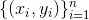
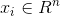
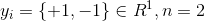
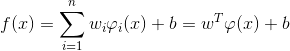

# Prediction Model

**SVR or Support Vector Regression** is a nonlinear model that as strong generalization ability, fast convergence speed, and has a relatively high forecast accuracy and short forecast time under the condition of small sample. We use this model throughout the entire application.

Given a training set  where  and . The regression function of SVR is

 (1)

## Data

Our data consists of Term 1, 2, and 4 scores of UPH Informatics students from 2012 to 2015. We carefully selected several courses that are taught regardless of the concentration and use those scores to predict the actual score in concentration-specific courses. 

We want to predict how much score a person would get in a particular concentration based on his general courses score from Term 1, 2, and 4. We will call this value CGPA or "Concentration GPA."

## References
(1) Li, Q., Fu, Y., Zhou, X., & Xu, Y. (2009). *The Investigation and Application of SVC and SVR in Handling Missing Values. 2009 First International Conference on Information Science and Engineering.*
