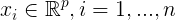
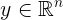
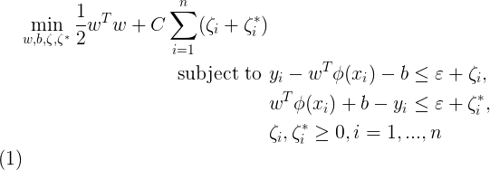
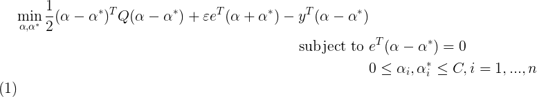
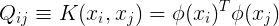
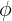
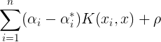

# Prediction Model

## Support Vector Machine (SVM)
**SVM or Support Vectore Machine** is a type of supervised learning technique that has multiple different methods. It is used for classification, regression, and outliers detection. This method is notably efficient to handle high number of features. Also, it's decision function is highly customizable. 

An SVM creates a hyper-plane or set of hyper-plane in an infinite dimensional space. A hyper-plane is concluded by finding the *largerst distance to the closest training data points in any class.* In general, the larger the margin is, the lower the generalization error will be.

There are two sets of learning model derived from SVM:
1. Support Vector Classification (SVC)
2. Support Vector Regression (SVR)

SVC is capable to do multi-class classification on a dataset.


**SVR** is an extension of SVC to solve regression problems. It is a nonlinear model that has strong generalization ability, fast convergence speed, and has a relatively high forecast accuracy and short forecast time under the condition of small sample. We use this model throughout the entire application. (2)

Given a training set  where . SVR solves the following problem



It's dual is



Where `e` is the vector of all ones, `C > 0` is the upper bound, `Q` is an `n` by `n` positive semidefinite matrix,  is the kernel function.

Training vectors or features are are mapped into higher dimensional space by function . 

The decision function is,




In this implementation, we will use `scikit-learn` machine learning library to implement SVM.(1)

## Hyper-parameter Optimization

Hyper-parameters are parameters that are not directly learnt within estimators. In this case, we use `GridSearchCV` provided by `scikit-learn` that does exhaustive search based on a parameters provided in `tuned_parameters`.

```python
  tuned_parameters = [{
            'kernel': ['rbf', 'poly', 'sigmoid', 'linear'],
            'gamma': [1, 0.1, 0.01, 1e-3, 1e-4, 'auto', 'scale'],
            'C': [1, 10, 100, 1000],
            'degree': [3, 4, 5],
        }]
```

In our implementation, we tested 4 different kernels, `rbf`, `poly`, `sigmoid` and `linear`. We also tested different values for `gamma`, `C`, and `degree` to find the best `score()` possible.

## Data

Our data consists of Term 1, 2, and 4 scores of UPH Informatics students from 2012 to 2015. We carefully selected several courses that are taught regardless of the concentration and use those scores to predict the actual score in concentration-specific courses.

We want to predict how much score a person would get in a particular concentration based on his general courses score from Term 1, 2, and 4. We will call this value **CGPA or "Concentration GPA."** Since SVR is a nonlinear model and we only have short amount of data, SVR is suitable for this purpose. **In short, general course scores are our features, and CGPA is our target**.

There are several missing values on the data due to the corresponding course not available for several batches. We need to impute those missing values. To do that, we use Mean Column Imputation method, which is using the mean of the whole column of a specific feature. (3)

```python
# Impute missing data
imputer = SimpleImputer(missing_values=np.nan, strategy='mean')
print("Imputing missing data...",end="\r")
imputer.fit(feature)
feature_array = imputer.transform(feature)
feature = pd.DataFrame(feature_array, columns=feature.columns)
```


## Training

**This training session is repeated for all corresponding concentration.**

First, we use `train_test_split()` to split our array into random train and test subsets. We use the `test_size` value of `0.3` and put a seed of 260 for `imdd`, 820 for `se`, and 903 for `mi`. (1)

Next we, train our SVR model with `GridSearchCV()` and try to compare the `r2` score and Mean Squared Error for each iteration. We are looking for the best `r2` score possible and the least Mean Squared Error possible. `tuned_parameters` has been explained in previous section.

```python
  clf = GridSearchCV(SVR(), tuned_parameters,
                       cv=2, iid=True,
                       refit='r2',
                       scoring=['r2', 'neg_mean_squared_error'],
                       )
    clf.fit(X_train, y_train)
```

After having the best model possible, we dump the model into `.sav` files to be called from the front-end.


## References
(1) Pedregosa et al. (2011) [*Scikit-learn: Machine Learning in Python.*](http://jmlr.csail.mit.edu/papers/v12/pedregosa11a.html) 

(2) Li, Q., Fu, Y., Zhou, X., & Xu, Y. (2009). *The Investigation and Application of SVC and SVR in Handling Missing Values. 2009 First International Conference on Information Science and Engineering.*

(3) Albon, Chris (2017). [*Impute Missing Values With Means.*](https://chrisalbon.com/machine_learning/preprocessing_structured_data/impute_missing_values_with_means/)


